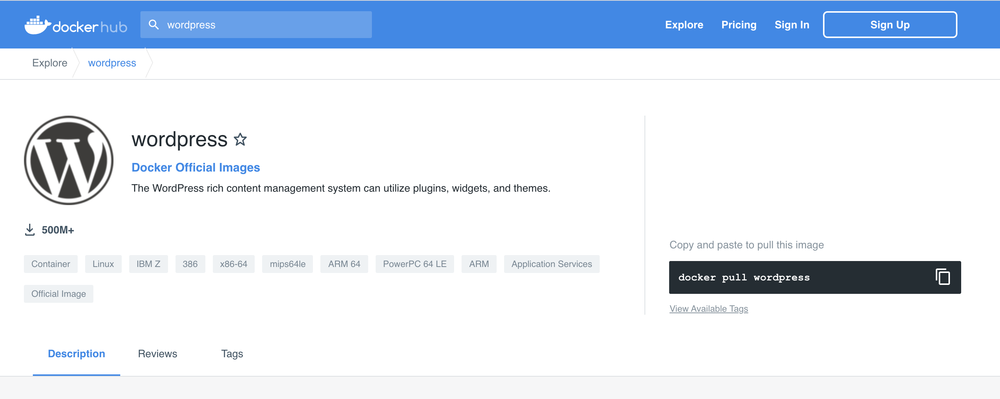

# Dev Padawan - Part 3

## Recently at Dev Padawans - what you've learned so far

- Python is a cool programming language
- You know how to run a Python application
- Not every computer is setup in the same way

## Your new challenge

In this exercise we'll overcome the issues with different system setups. For that we'll combine two technologies:

- Docker containers
- Development containers in Visual Studio Code

We'll also look into other setup information that is needed in Python if you want to re-use Python libraries allowing you to e.g. easily create PowerPoint slide decks.

### The developer / computer dilemma

We've seen in thr previous dev padawan session, that the same code might not be running in the same wayx on every computer. Depending on the operating system (MS Windows, Mac OS, Linux) and depending what kind of software you have installed (e.g. python 2.x or 3.x) the code might need to be changed slightly. Even worse, there might be also a need to have additional packages installed that are related to a specific software (e.g. a python package to create PPTX slides).

As a developer who is developing just for fun, this might not be a big issue. You might even learn a lot more through such problems and you become a better developer. But as a professional developer you want to concentrate on your code and to make it run quickly. Ideally completly independet of the setup of a computer. That's the reason why virtual machines have been developed a while back.

### Virtual machines

In essenece a virtual machine is a (virtual) computer on a computer. 

The virtual machine has a complete operating system (guest OS) that can use shared storage. The virtual machine runs on a virtualization server and that server ensures, that the computers' hardware is provide to the virtual operating system.

Now a developer can develop software that runs for such a defined setup of a virtual machine.

This is already great, but that setup is using a lof of CPU/RAM from the operating system of the real computer (host OS). In addition such a virtual machine can become quite big in terms of necessary storage for the OS. To overcome these issues, containers where invented.

### (Docker) Containers

A container doens't need a separate operating system. The **Container Engine** ensures that whatever you pull together in terms of apps, binaries or libraries is running on top of the operating system of your computer. All these assets are read-only and do not change your computers' operating system.

The container includes all the code, its dependencies and even the operating system itself. This enables applications to run almost anywhere — a desktop computer, a traditional IT infrastructure or the cloud. Meaning that containers have a great level of flexibility and portability.


Most developers prefer a Linux-like container, with a corresponding way how to install and run software.

And due to the HUGE community for Docker containers, you can find all kinds of containers at [Docker Hub](https://hub.docker.com/).

You can event get a [Wordpress docker container](https://hub.docker.com/_/wordpress) running on your machine whithin a couple of minutes.



### Dev Containers in Visual Studio Code 

Microsoft has put together some tools within VS Code to even let you develop software in a container. 

For that purpose your code for a repository needs to have a folder called **.devcontainer**. 

Within that folder you have a **devcontainer.json** file, which tell VS Code, what kind of development container you want. 

The **Dockerfile** in the folder tells VS Code how to build that development container.

## Homework

### Run the python script

First of all run the python script within this project on your VS Code as a dev container.
Within the dev container run the following command in the terminal:
````
python padawan-part3.py
````
A PPTX file should be created that you can open in your Windows Explorer or your Mac Finder.

### Understand the python script

Checkout the code in the file **padawan-part3.py** and try to understand it. Change it a bit and see how it changes the PPTX file.

### Run wordpress as a container on your computer

Try out one of the many [tutorials, explaining how to run Wordpress in a container](https://themeisle.com/blog/local-wordpress-development-using-docker/).

Once you have Wordpress up-and-running on your machine, you will feel the Force becoming really strong inside of you.

### Practice

Now my dear padawan you'll have to practice more and more and more.

Maybe you create your first own python app. Google will help you find great tutorials.

In addition you can try out to install other docker containers on your machine. And don't forget to delete all the other docker images on your computer from time to time :-) .

# See you after the summer season

We'll have a short summer break. Meanwhile you can practice and let me know, where you'd like to deep-dive more in the next sessions. More around developing apps? Or about creating a first app with SAP technology like [CAP](https://cap.cloud.sap/docs/)?

> Yoda: “[A Jedi's strength flows from the Force](https://www.youtube.com/watch?v=gONQCIevSN0)”
